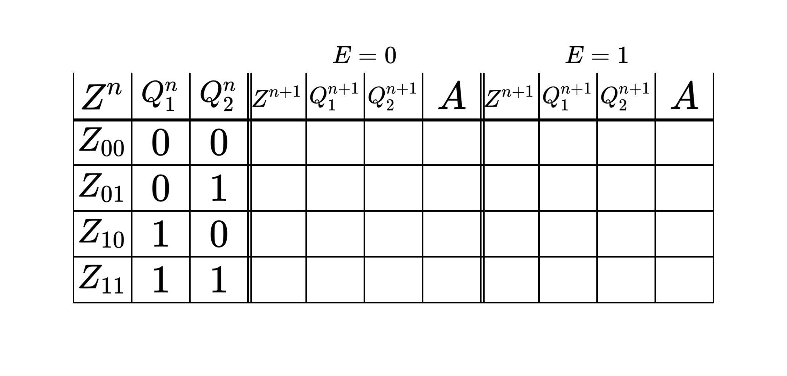

# Automatentafel Generator

Für das Modul Nachrichtencodierung habe ich hier einen PDF Generator erstellt, welcher abhängig von einigen Parametern eine leere Automatentafel als PDF erstellen kann. Zum ausführen des Programmcode ist die Anwendung [Processing](https://processing.org/) herunterzuladen.

Da ich keine gute LaTeX Library gefunden habe. Nutze ich folgende self-hosted API: https://github.com/chialab/math-api

### Parameter

- `binary_states`: Gibt die Anzahl der Speicher an. Die Anzahl der Zustände ermittelt sich dann mit .
- `binary_inputs`: Die Anzahl der Input-Stellen. 2 Stellen würde zu  Eingangswerten führen.
- `binary_outputs`: Die Anzahl der Output-Stellen. 2 Stellen würde zu einem Ausgang  und  führen.
- `scale`: Da die LaTeX Formeln als PNG eingespeißt werden kann man mit dem Scale Faktor die Auflösung anpassen.

### Beispiel

`binary_states = 2`
 
`binary_inputs = 1`
 
`binary_outputs = 1`
 

